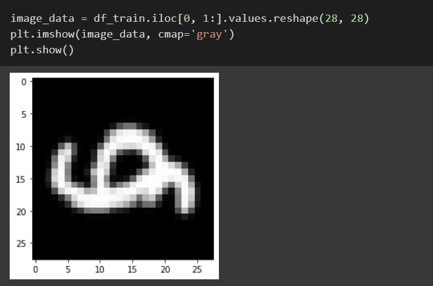
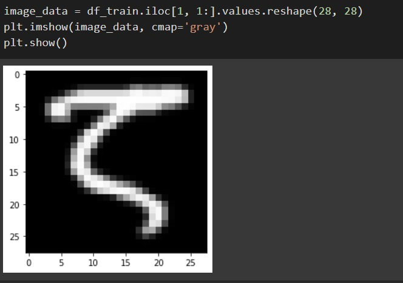
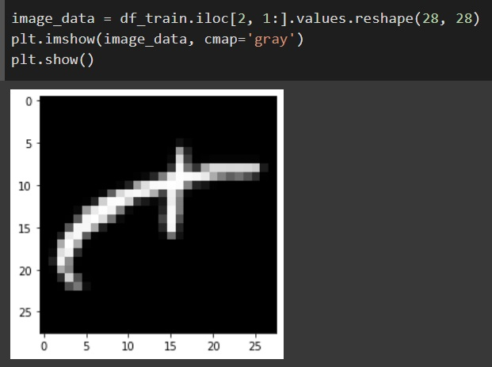

# Abstract

This report examines neural networks and the impact of various parameter values on their output using the EMNIST dataset, which consists of 47 classes. We explore the effects of parameters such as the number of layers, dropout techniques, and batch normalization on network performance.

# Introduction

To begin, we use a simple neural network and the PyTorch library for data classification. In neural networks, the number of layers varies depending on the selected dataset. Our goal in the first part is to investigate the impact of the number of layers on the network's accuracy by analyzing different layer counts and their corresponding outputs.

In the second part, we examine the dropout technique, where some connections between the nodes in the neural network are removed, transitioning the network from a fully connected state. Finally, we explore batch normalization, where input data is normalized.

# Methods

## Layer Depth

### Input Data

Initially, we stored the EMNIST dataset in a dataframe. This dataset consists of handwritten letters, with 112,000 samples for training and 18,000 samples for testing, totaling 47 different classes. Some sample images are shown below:


*Figure 1: Handwriting Sample 1*


*Figure 2: Handwriting Sample 2*


*Figure 3: Handwriting Sample 3*


### Neural Network

To start working with the data, we built a neural network with 5 layers:
- Input: 768 inputs corresponding to the number of pixels in each image.
- Layer 1: 256 units
- Layer 2: 128 units
- Layer 3: 64 units
- Layer 4: 32 units
- Layer 5 (Output): 47 units, corresponding to the number of classes in the data.

```python
(hidden_layer_1): Linear(in_features=784, out_features=256, bias=True)
(hidden_layer_2): Linear(in_features=256, out_features=128, bias=True)
(hidden_layer_3): Linear(in_features=128, out_features=64, bias=True)
(hidden_layer_4): Linear(in_features=64, out_features=32, bias=True)
(output_layer): Linear(in_features=32, out_features=47, bias=True)
(activation): Sigmoid()

epoch:1, batch: 1,  loss: 3.9197189807891846
epoch:1, batch: 2,  loss: 3.7803547382354736
epoch:1, batch: 3,  loss: 3.820791721343994
epoch:1, batch: 4,  loss: 3.8216171264648438
epoch:1, batch: 5,  loss: 3.9444422721862793
epoch:1, batch: 6,  loss: 3.789818525314331
...
epoch:3, batch: 1,  loss: 3.6751136779785156
epoch:3, batch: 2,  loss: 3.240877628326416
epoch:3, batch: 3,  loss: 3.474587917327881
epoch:3, batch: 4,  loss: 3.2376105785369873
...
epoch:10, batch: 22553,  loss: 2.332615375518799
epoch:10, batch: 22554,  loss: 2.185699462890625
epoch:10, batch: 22555,  loss: 3.096320152282715
epoch:10, batch: 22556,  loss: 2.828044891357422
epoch:10, batch: 22557,  loss: 3.167339563369751
epoch:10, batch: 22558,  loss: 3.2242043018341064
epoch:10, batch: 22559,  loss: 3.1808066368103027
epoch:10, batch: 22560,  loss: 2.687216281890869
```


