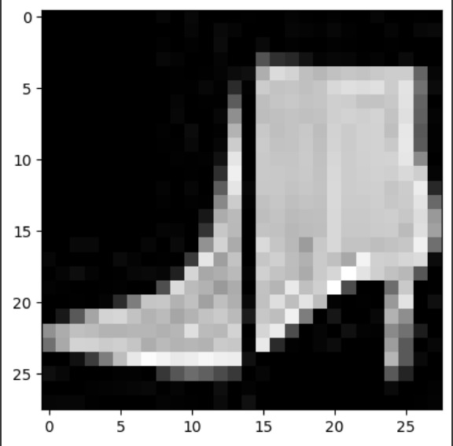
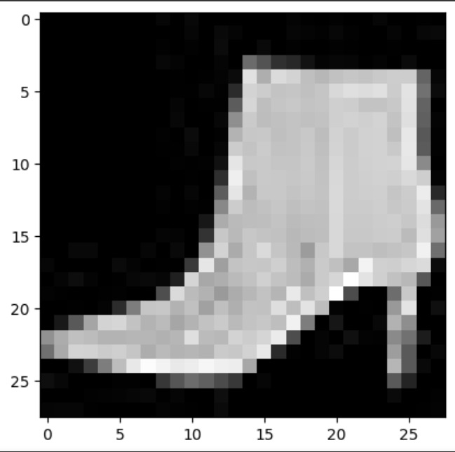
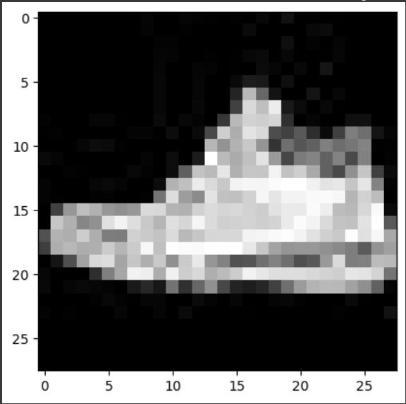
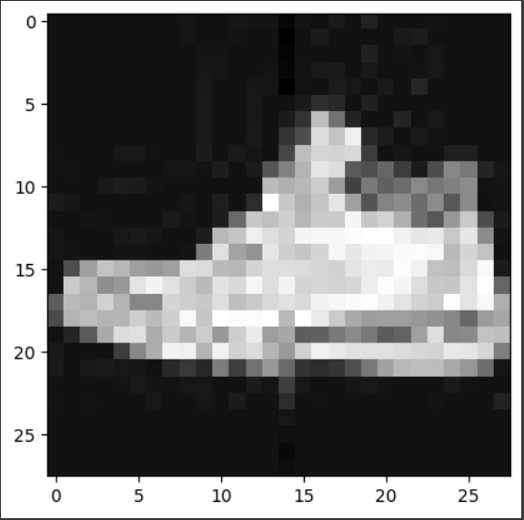
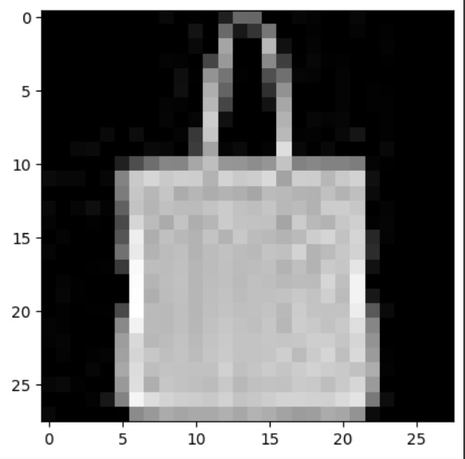
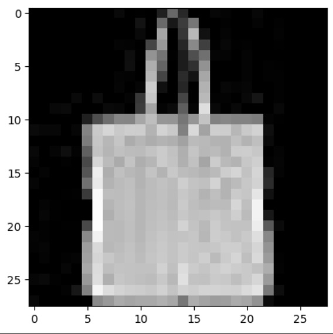

# Abstract

In this report, we implement a neural network on the FashionMNIST dataset, which consists of 28x28 pixel images with the middle column of pixels removed and stored in a separate file. The goal of this report is to implement a neural network that predicts the removed column of the images. We also examine the impact of different methods on the network's output and accuracy.

# Introduction

Image completion is a key task in computer vision that involves predicting missing pixel values in an image. In this exercise, we aim to implement an MLP neural network to predict the missing column in images. We will also explore different methods in neural networks and evaluate their impact on overall accuracy on test data.

  
*Figure: Image with middle column removed*

# Methods

## MLP Implementation

To start working on the data, we built a neural network with 5 layers:
- Input: 784 inputs (equal to the number of pixels in each image)
- Layer 1: 256 neurons
- Layer 2: 128 neurons
- Layer 3: 64 neurons
- Layer 4: 28 neurons

```python
Net(
  (fc1): Linear(in_features=784, out_features=256, bias=True)
  (fc2): Linear(in_features=256, out_features=128, bias=True)
  (fc3): Linear(in_features=128, out_features=64, bias=True)
  (fc4): Linear(in_features=64, out_features=28, bias=True)
)
```

The activation function used is RELU. For error calculation, MSE (Mean Squared Error) was used, which is suitable for regression problems. For training, we used SGD (Stochastic Gradient Descent) with a learning rate of 0.001. Data was fed in batches of 32 and updated in each epoch. The loss values in different batches are as follows:
```python
epoch:1, batch: 1,  loss: 0.3032597601413727

epoch:5, batch: 1,  loss: 0.0364769771695137

epoch:7, batch: 1,  loss: 0.03293081000447273

epoch:10, batch: 1500,  loss: 0.03313985466957092
```
Using the MAE (Mean Absolute Error) formula, the average absolute error on the test data was obtained as MAE: 0.3559.

Finally, we present several images for comparison, which include two sections: the first section contains the real image with the actual missing column, and the second section contains the column produced by the neural network.

#### Image 1


*Figure 1: Real Image 1*


*Figure 2: Image generated by the neural network 1*

#### Image 2


*Figure 3: Real Image 2*


*Figure 4: Image generated by the neural network 2*

#### Image 3


*Figure 5: Real Image 3*


*Figure 6: Image generated by the neural network 3*

