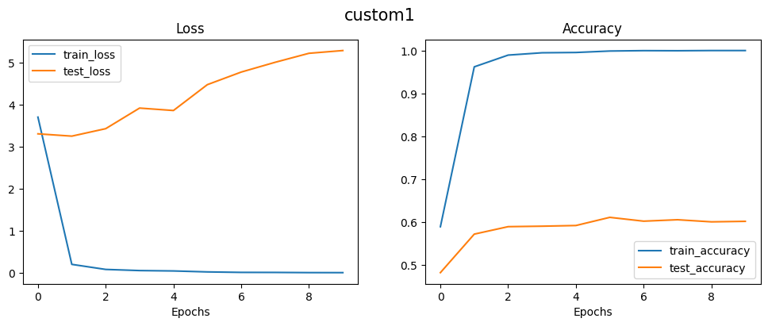
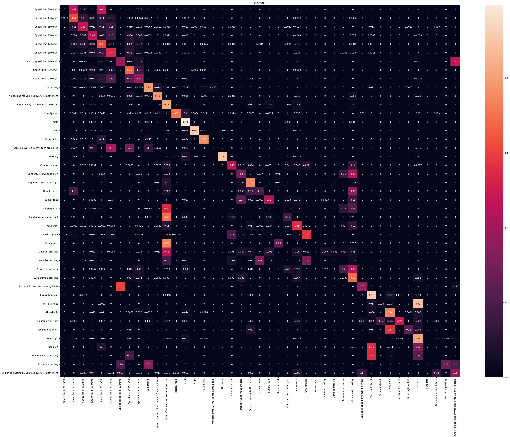
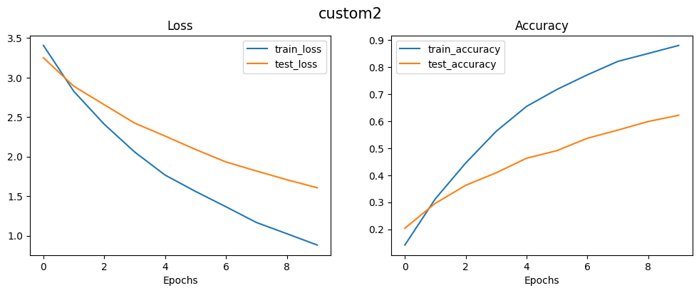
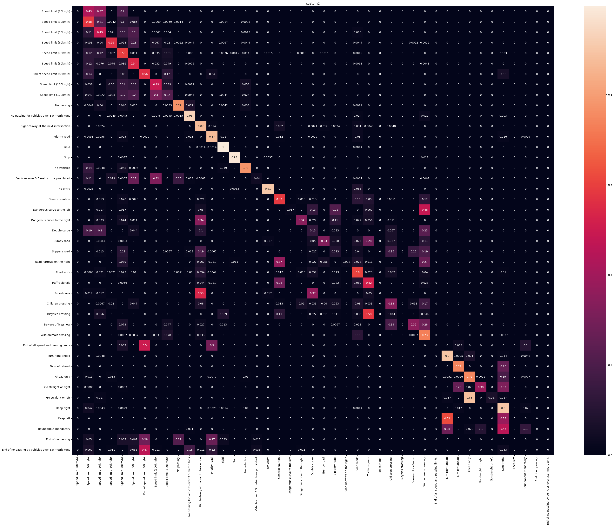
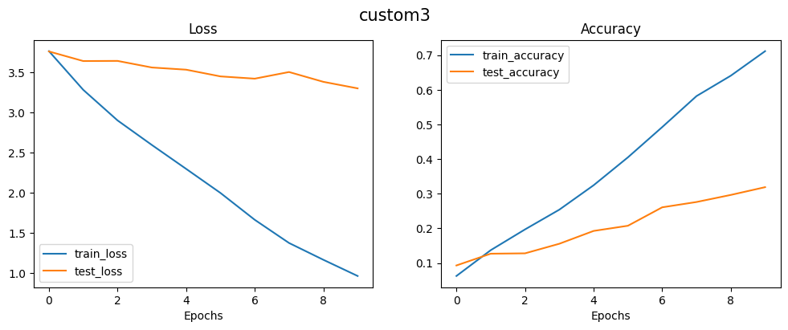
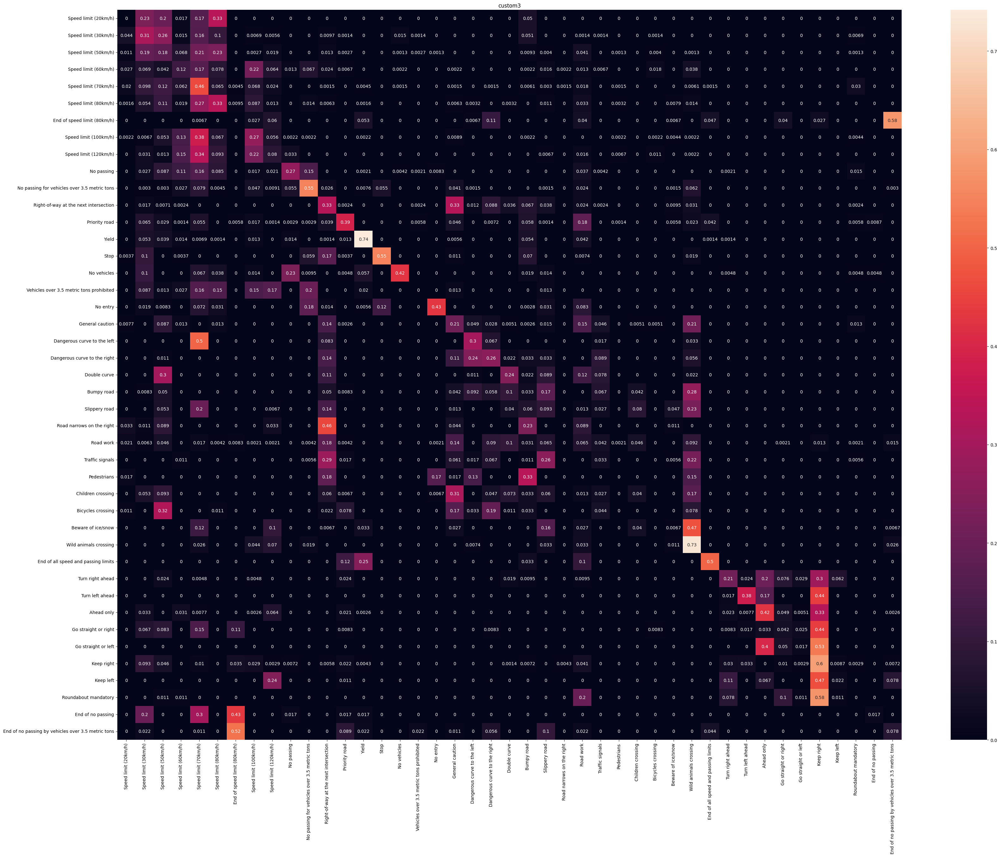

## Abstract

We aim to explore Convolutional Neural Networks (CNNs) and their performance on traffic sign data. We created and examined three different CNN architectures and evaluated their results using three pre-trained models: ResNet, AlexNet, and Vision Transformer. Additionally, we identified misclassified classes and assessed the impact of grayscale conversion on accuracy and various metrics.

## Introduction

This report investigates the behavior of CNNs on the Traffic Sign dataset, which contains 34,799 images, each with dimensions 32x32 pixels and in RGB color format. We designed and optimized several neural network models and evaluated their performance on this dataset. We analyzed metrics such as F1-score, precision, recall, and the confusion matrix. We also explored transfer learning using pre-trained models and fine-tuned them on our dataset. We identified classes with the highest misclassification rates and explored potential reasons. Finally, we examined whether converting images to grayscale affects training and model accuracy.

---

## Methods

We will discuss the methods and models used, as well as the results obtained on the dataset.

### Custom CNN Implementation

Our goal in this section is to build and compare several neural networks and analyze their performance on the dataset. We implemented three types of CNNs:

1. **Network 1**: This network has 2 convolutional layers with padding=1 and kernel size=3. It ends with a fully connected layer with the RELU activation function.

2. **Network 2**: This network has 4 convolutional layers with padding=1 and kernel size=3, followed by 2 fully connected layers. It uses the RELU activation function and incorporates batch normalization and dropout with a rate of 0.3.

3. **Network 3**: This network features 8 convolutional layers with padding=1 and kernel size=3, followed by 3 fully connected layers. It also uses the RELU activation function, along with batch normalization and dropout with a rate of 0.3.

4. ## Figures

### Accuracy and Loss for 1st CNN

### Confusion Matrix for 1st CNN

### Accuracy and Loss for 2nd CNN

### Confusion Matrix for 2nd CNN

### Accuracy and Loss for 3rd CNN

### Confusion Matrix for 3rd CNN

## Performance Metrics

| Number | Accuracy | F1 Score | Precision | Recall |
|--------|----------|----------|-----------|--------|
| 1      | 0.601    | 0.443    | 0.486     | 0.451  |
| 2      | 0.622    | 0.438    | 0.527     | 0.443  |
| 3      | 0.319    | 0.226    | 0.259     | 0.226  |

*Table: Performance Metrics*
