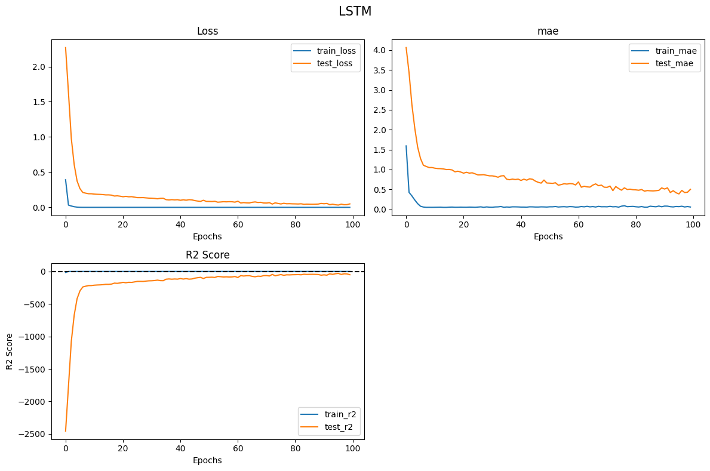
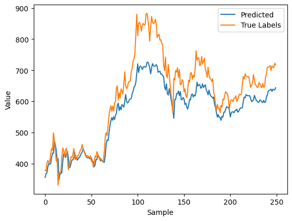
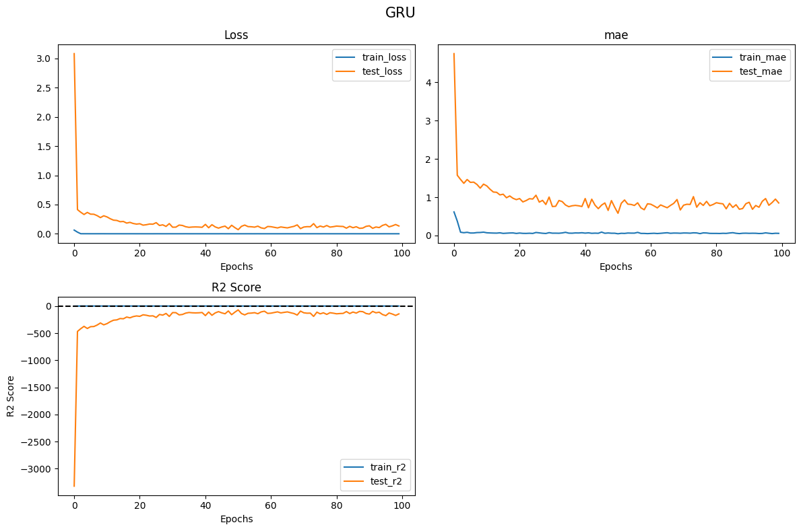
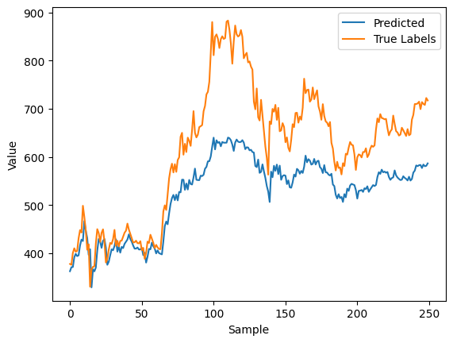
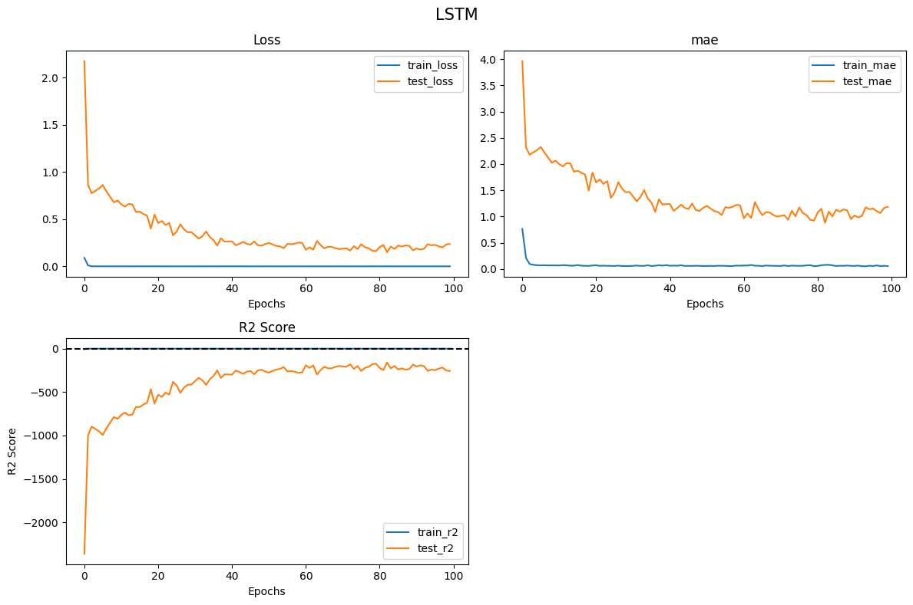
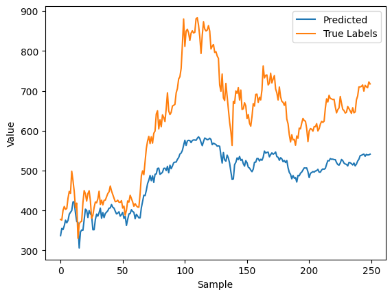
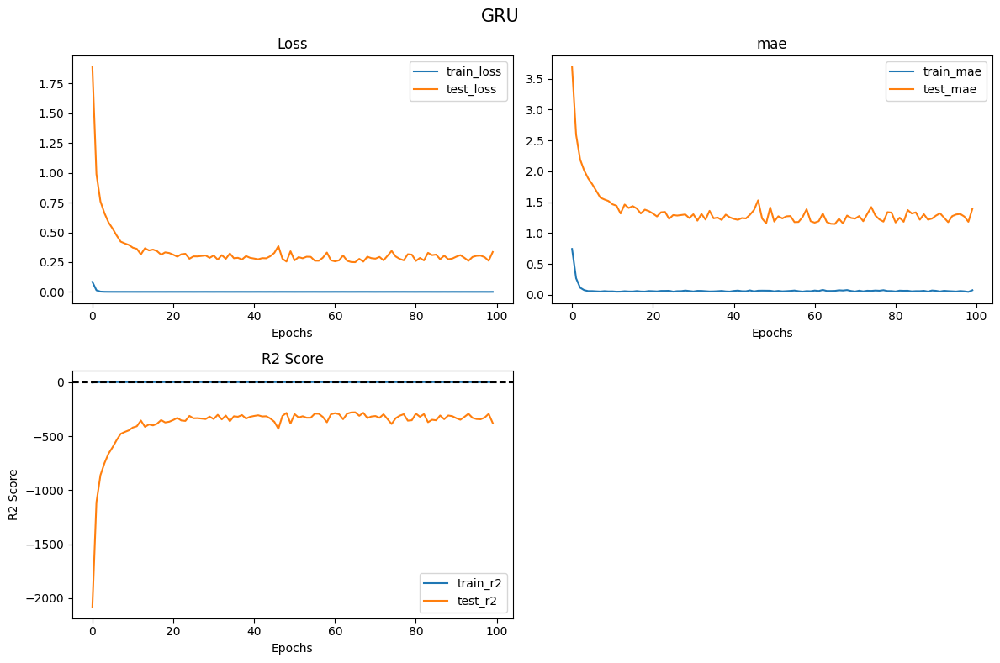
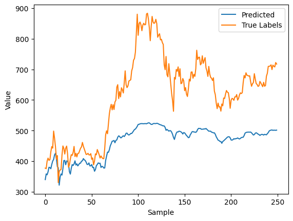
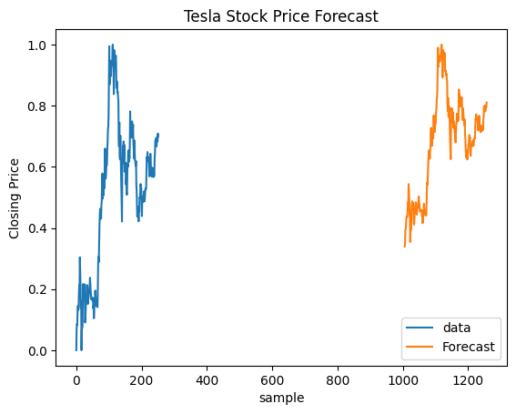

# Abstract

In this exercise, we use RNN neural networks to estimate Tesla's stock price in the financial market. We employed various models of this neural network, including LSTM and GRU. We used a single feature to estimate the price in each model and then used multiple features for estimation. We compared the results with the actual values in a chart and plotted the error rates during training and testing.

# Introduction

RNNs are a type of neural network used for learning from sequential data. By understanding the relationships between data points in a sequence, they help us in predicting final prices. In this exercise, we predict Tesla's stock price using two neural networks: LSTM and GRU. These two networks are designed to learn from long sequences and understand long-term dependencies in sequential data. LSTM controls the flow of information over time using a memory cell, input gate, forget gate, and output gate, while GRU operates by combining the forget and input gates into a single update gate.

For training these two neural networks, we used two types of data for prediction. In the first case, we used only one feature to predict the price, and in the second case, we used multiple features to predict Tesla's stock price. To do this, we first converted the data into a suitable format for these neural networks and divided it into training and testing data. Finally, we plotted the results, including the values of loss, MAE, and R2, in tables and charts, comparing the predicted and actual values.

# Methods

## Univariable

Now, let's discuss the methods and models used in each section and the results obtained from the data. First, we need to convert the data into the appropriate format. For this, we initially used only the `close` column, which contains the prices, to predict prices. Each data sequence was 8 points long, ultimately returning one price as the output. We then split the data into training and testing sets with an 80/20 ratio.

Afterward, the data was fed into the neural networks for training. We used `epoch=100` and `learning_rate=0.001` in both models. Using one feature, we predicted the prices, and finally, we displayed the error charts during training and testing, comparing the predicted and actual values with the test data. The results are as follows:

| Epoch | train_loss | train_mae | train_r2 | test_loss | test_mae | test_r2 |
|-------|------------|-----------|----------|-----------|----------|---------|
| 100   | 0.0005     | 0.0570    | 0.9820   | 0.0495    | 0.5009   | -49.0629|

| Epoch | train_loss | train_mae | train_r2 | test_loss | test_mae | test_r2 |
|-------|------------|-----------|----------|-----------|----------|---------|
| 100   | 0.0006     | 0.0557    | 0.9802   | 0.1336    | 0.8497   | -144.3005|

## Multivariable

In the next scenario, we used other columns for price prediction. Specifically, we used the columns: `open`, `high`, `low`, `adj close`, and `volume` to predict the prices in the `close` column. Each data sequence was considered to be of length 8. We split the data into training and testing sets with an 80/20 ratio.

The data was then fed into the neural networks for training. We used `epoch=100` and `learning_rate=0.001` in both models. The results are displayed in the charts below.

| Epoch | train_loss | train_mae | train_r2 | test_loss | test_mae | test_r2 |
|-------|------------|-----------|----------|-----------|----------|---------|
| 100   | 0.0006     | 0.0551    | 0.9791   | 0.2369    | 1.1833   | -256.3241|

| Epoch | train_loss | train_mae | train_r2 | test_loss | test_mae | test_r2 |
|-------|------------|-----------|----------|-----------|----------|---------|
| 100   | 0.0007     | 0.0752    | 0.9729   | 0.3350    | 1.3947   | -377.8517|

## ARIMA

In this section, we used the ARIMA model, which is applicable for forecasting time-series data, to predict prices and compared the results with actual values in a chart. After several trial and error attempts, we determined that ARIMA(5,1,3) was the most suitable configuration for this model.

# Conclusion

Based on the results obtained, both GRU and LSTM models performed well in predicting prices, with the univariable approach showing greater accuracy compared to the multivariable approach. The ARIMA model, a statistical model in this domain, also demonstrated a satisfactory performance.
