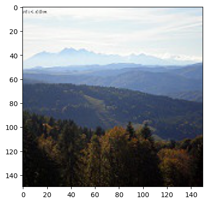
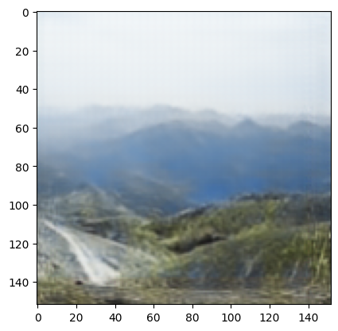

## Abstract

In this exercise, we use autoencoders to predict the color of grayscale images. The model is trained on the data, and the output of the model is compared with the real images. Additionally, we use a specific type of autoencoder called Variational Autoencoder (VAE) to generate color images from grayscale ones.

## Introduction

Autoencoders are a type of neural network consisting of two parts: an encoder and a decoder. The encoder compresses the data and extracts its main features, while the decoder uses these extracted features to reconstruct the data. In this exercise, we use autoencoders to colorize grayscale images. The model takes grayscale images as input, extracts their main features, and starts generating color images.

We calculate the errors for both test and training phases, plot them on charts, and compare several generated samples with real color images. In addition to the autoencoder model, we use VAE and display the results. The VAE extracts features that follow a specific probability distribution.

## Methods

### Implementation of Autoencoder

The autoencoder is designed with two parts: the encoder and the decoder. The encoder includes the following layers:

- `nn.Conv2d(1, 32, kernel_size=3, stride=1, padding=1)`
- `nn.Conv2d(32, 64, kernel_size=3, stride=2, padding=1)`
- `nn.Conv2d(64, 128, kernel_size=3, stride=1, padding=1)`
- `nn.Conv2d(128, 256, kernel_size=3, stride=2, padding=1)`

In all layers, the ReLU activation function is used. The decoder is implemented in reverse order of these layers and uses the sigmoid activation function at the end.

For training, the data was split into training and testing sets (80/20 ratio). The model was trained with `batch_size=16` and `learning_rate=0.001`.

| Epoch | train_loss | test_loss |
|-------|------------|-----------|
| 20    | 0.1329     | 0.1308    |

Several samples of images generated by the autoencoder are shown and compared with their real color counterparts:

### Implementation of VAE

We also implemented a Variational Autoencoder (VAE) with 4 layers:

- `nn.Conv2d(1, 32, kernel_size=3, stride=1, padding=1)`
- `nn.Conv2d(32, 64, kernel_size=3, stride=2, padding=1)`
- `nn.Conv2d(64, 128, kernel_size=3, stride=2, padding=1)`
- `nn.Conv2d(128, 256, kernel_size=3, stride=2, padding=1)`

ReLU activation is used in each layer, and the decoder is implemented in reverse order to generate color images. The sigmoid activation function is used at the end.

Training was performed with `learning_rate=0.001`, `batch_size=64`, `latent_dimension=100`, and `epoch=30`. The results on the test data are shown below:

## Conclusion

We used two different methods to generate color images. The first method used autoencoders, which successfully produced color images from grayscale ones. The results showed that the number of layers and model complexity significantly impact the quality of generated images. A more complex model can lead to overfitting, while a simpler one may reduce accuracy. We also used MSE and cross-entropy loss functions, with MSE providing better results.

In the second method, VAE was used to generate color images. The latent space size had a direct impact on the quality of the final results. However, a larger latent space increased processing time. We provided results with a latent space size of 100.
